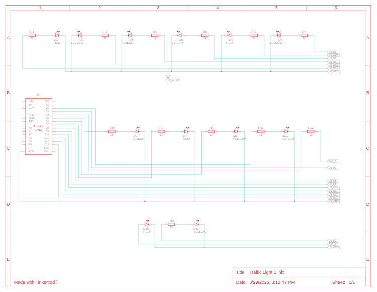
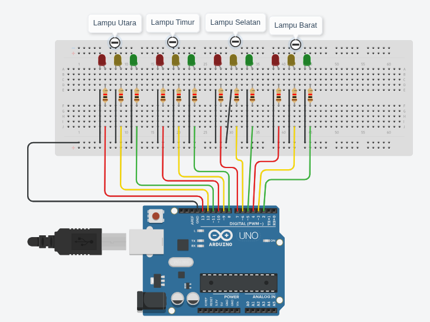

# Tugas Pemrograman Sistem Tertanam
### Rizki Arif Saifudin - H1D023067
## Penyelesaian Spesifikasi Tugas

Kode `trafficControl.ino` telah sepenuhnya memenuhi semua spesifikasi tugas yang diberikan:

### Spesifikasi yang Terpenuhi

#### 1. **Kembangkan traffic light satu sisi menjadi empat sisi**
   - Sistem dikembangkan untuk mengontrol 4 arah: **Utara, Timur, Selatan, Barat**
   - Masing-masing arah memiliki 3 lampu (Merah, Kuning, Hijau)
   - Total 12 LED dikendalikan melalui pin Arduino (pin 2-13)

#### 2. **Sistem bekerja otomatis dan berulang (looping)**
   - Fungsi `loop()` menjalankan siklus secara terus-menerus
   - Siklus berjalan otomatis tanpa intervensi pengguna
   - ```cpp
     void loop(){
       aktifkanSimpang("utara");      
       aktifkanSimpang("timur");      
       aktifkanSimpang("selatan");    
       aktifkanSimpang("barat");      
     }
     ```

#### 3. **Lampu hijau menyala bergiliran searah jarum jam**
   - Urutan: **Utara → Timur → Selatan → Barat → Ulangi**
   - Implementasi di dalam `loop()` dengan urutan pemanggilan fungsi
   - Setiap arah mendapat kesempatan hijau secara bergiliran

#### 4. **Kondisi default: Semua lampu MERAH sebelum satu sisi aktif**
   - Fungsi `modeDefault()` menyalakan semua lampu merah pada awal sistem
   - Sebelum setiap arah diaktifkan, `modeDefault()` dipanggil terlebih dahulu
   - ```cpp
     void modeDefault(){
       // Matikan semua lampu
       for (int i = 2; i <= 13; i++) {
         digitalWrite(i, LOW);
       }
       // Nyalakan semua lampu merah
       digitalWrite(um, HIGH);  // Utara
       digitalWrite(tm, HIGH);  // Timur
       digitalWrite(sm, HIGH);  // Selatan
       digitalWrite(bm, HIGH);  // Barat
     }
     ```

#### 5. **Waktu nyala lampu sesuai spesifikasi**
   - **Lampu Hijau**: Menyala 5 detik (`delay(5000)`)
   - **Lampu Kuning**: Berkedip 3 kali + menyala 2 detik (total 4 detik)
     - Kedip: 3 × (333ms ON + 333ms OFF) = ~2 detik
     - Stabil: 2 detik
   - **Lampu Merah**: Menyala kembali setelah hijau selesai

#### 6. **Aturan sistem terpenuhi**
   - ✓ **Tidak ada lebih dari satu sisi hijau bersamaan**
     - Hanya satu fungsi `aktifkanSimpang()` yang dijalankan dalam satu waktu
     - Lampu hijau hanya menyala untuk satu arah per siklus
   
   - ✓ **Sistem berjalan terus-menerus (loop)**
     - Fungsi `loop()` berjalan tanpa batas
     - Siklus berulang otomatis
   
   - ✓ **Menggunakan fungsi untuk modularisasi**
     - `modeDefault()`: Mengelola kondisi default semua lampu merah
     - `aktifkanSimpang(String arah)`: Menangani siklus lampu untuk satu arah
     - `setup()`: Inisialisasi pin
     - Kode terstruktur dan mudah dipahami

---

## 🔧 Komponen Hardware

| Komponen      | Jumlah | Keterangan                       |
| ------------- | ------ | -------------------------------- |
| Arduino Board | 1      | Mikrokontroler utama             |
| LED Merah     | 4      | Satu untuk setiap arah (simpang) |
| LED Kuning    | 4      | Satu untuk setiap arah (simpang) |
| LED Hijau     | 4      | Satu untuk setiap arah (simpang) |
| Resistor 220Ω | 12     | Untuk membatasi arus LED         |
| Breadboard    | 1      | Untuk koneksi komponen           |
| Kabel Jumper  | -      | Untuk menghubungkan komponen     |

### Konfigurasi Pin Arduino

```
Utara:
- Pin 13: Lampu Merah (um)
- Pin 12: Lampu Kuning (uk)
- Pin 11: Lampu Hijau (uh)

Timur:
- Pin 10: Lampu Merah (tm)
- Pin 9:  Lampu Kuning (tk)
- Pin 8:  Lampu Hijau (th)

Selatan:
- Pin 7:  Lampu Merah (sm)
- Pin 6:  Lampu Kuning (sk)
- Pin 5:  Lampu Hijau (sh)

Barat:
- Pin 4:  Lampu Merah (bm)
- Pin 3:  Lampu Kuning (bk)
- Pin 2:  Lampu Hijau (bh)
```

## 📸 Gambar Pendukung

### Rangkaian Skematik


_Placeholder: Diagram skematik menunjukkan koneksi LED dengan resistor ke pin Arduino_

### Diagram Breadboard


_Placeholder: Layout fisik komponen di breadboard dan koneksi ke Arduino_
